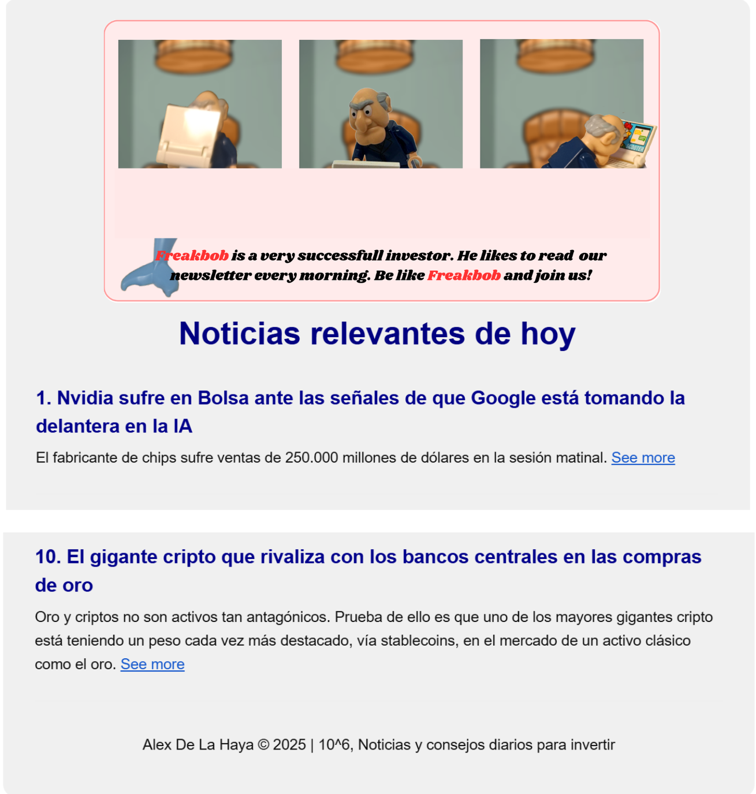
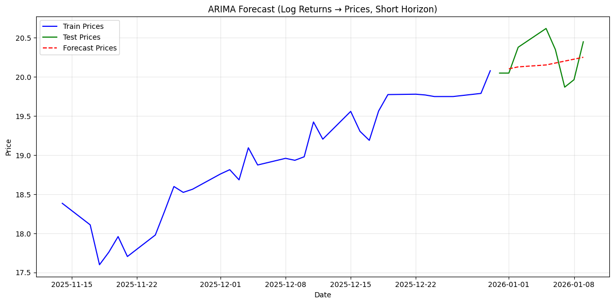
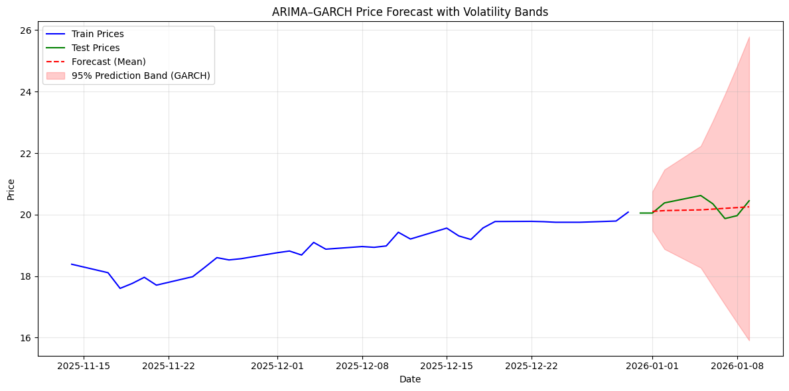
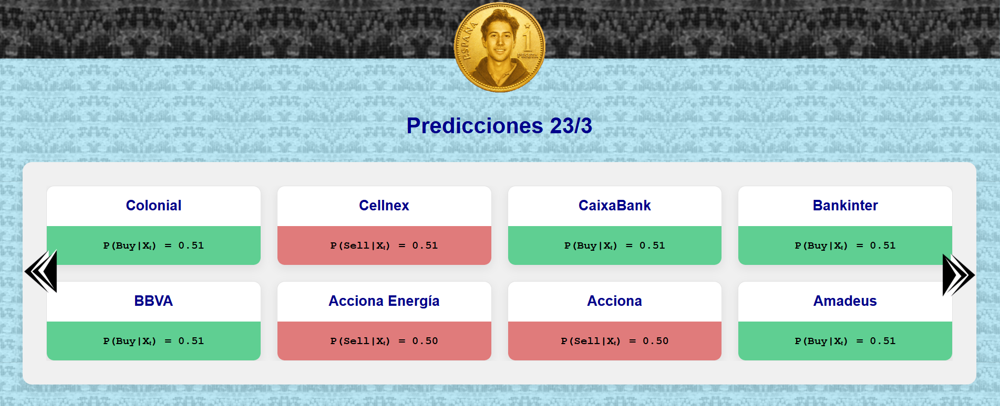

# 10**6 - Final Degree Thesis

This repository contains the code for my final degree thesis. The goal is to build a tool that empowers investors to obtain powerful insights at a glance. By leveraging multimodal, data-driven analysis, the system aims to support smarter investment decisions and potentially achieve better returns compared to traditional techniques.

Read my final degree thesis [here](https://dummyimage.com/800x400/2d2d2d/ffffff&text=WIP+%7C+Coming+Soon).

----

## Project description 

### First Deliverable: Newsletter Automation

A daily newsletter is sent (automatically at 9.00 a.m UTC) containing the top-10 most relevant stock-related news articles of today.

The pipeline is the following. First fetch Expansión RSS (Mercados, Ahorro, Empresas). Then preprocess and filter relevant news. Convert to html, embed an image and finally send the newsletter. The workflow can be executed both locally and from GitHub Actions.

#### Newsletter example


### Second Deliverable: Database Ingestion and Time Series Modeling

From Monday to Friday after the Spanish market closes, Open, High, Low, Close, and Volume (OHLCV) data are automatically fetched for all IBEX35 companies and appended to the database.

We then apply ARIMA models to BBVA.MC prices and log returns over short-term and long-term horizons. Prices are non-stationary, while log returns behave as white noise, making ARIMA a suitable baseline model. Forecast variance increases over time, making long-term forecasts unreliable. 

#### Arima forecast 


### Third Deliverable: Further Time Series Modeling and news Ingestion

We then incorporate a GARCH model to better capture volatility dynamics. Variance is now not assumed constant and prediction residuals are heteroskedastic, reflecting the clustering of shocks over time. Confidence bands are provided around the forecasts, illustrating how uncertainty expands as the prediction horizon increases. 

#### Garch forecast


Stock-related news articles are processed on a daily basis. A Large Language Model (LLM) extracts mentioned companies, performs sentiment analysis and determines relevance. Then they are stored. 

**How is information stored?**
Initially, a GitHub automation bot fetched data, appended it to a local database, and committed updates directly to the repository. The system has now evolved to use a cloud database provider. 

### Fourth Deliverable: Time Series Modeling III and Website

We incorporate a machine learning approach to predict short-term (1day) stock movements for all IBEX35 companies. The model uses micro-level features, and a Random Forest classifier is trained to output both a prediction (buy or sell) and an associated probability. This simple model will serve as baseline ML approach.

Predictions, along with a general explanation of the methodology, model selection, and backtesting results, are available on our
[website](https://alexhayadela.github.io/10tothe6_TFG_2025_AlexDeLaHaya/docs/).

#### Website predictions


The website is hosted using Github Pages. While the site is static, predictions are updated dynamically through an automation which runs the model, generates new forecasts and updates published content.

### Fifth Deliverable (Part A): Trading Bot

A bot performs trades based on our model predictions and connects to a broker API. When the market opens, it executes the predictions, and before the market closes, it liquidates positions that have generated profit. The bot runs every trading day while the market is open. By default, it operates on a paper trading account with a simulated balance of 100,000€. 

----

## Project Structure

```
/10tothe6_TFG_2025_AlexDeLaHaya
├── .github/workflows           # Automation scheduling and execution
|
├── data/                       # Stored OHLCV market data
├── imgs/ 
|
├── ingest/                     # Market data ingestion pipelines
├── models/                     # Financial time-series models
├── news/                       # News ingestion and newsletter automation
|
├── requirements/               # Python dependency specifications
├── .gitignore                  # Git ignore rules
└── README.md                   # Project overview and usage
```
----

## Project Setup

Open a terminal console and execute:
```bash
cd <your preferred projects root directory>
git clone https://github.com/alexhayadela/10tothe6_TFG_2025_AlexDeLaHaya.git
```
> [!IMPORTANT]
> Every command from now on, assumes you are in project root directory.

### Install python

Python 3.10+ is needed

### Install packages
Creating up a virtual environment is recommended to isolate the project dependencies.

```bash
python -m venv venv
```

Activate the environment:
```bash
venv\Scripts\activate
```

Install all the packages listed in `requirements.txt` with:
```bash
pip install -r requirements/all.txt
```

### Create .env file 

You need to create a .env file (project root) containing the following information:

1. EMAIL_USER=...@gmail.com
2. EMAIL_PASSWORD=...
3. GROQ_API_KEY=gsk_...
4. SUPABASE_API_KEY=sb_secret_...
5. SUPABASE_URL=https://<...>.supabase.co

- Gmail password must be a Google App Password. [How do I get one?](https://support.google.com/accounts/answer/185833).  
- Generate a Groq API key [here](https://console.groq.com/keys).
- Configure Supabase URL/API key in their [page](https://supabase.com). 

### Add Github Secrets

You need to configure github secrets to run the automation.

1. Go to Github → Settings → Secrets and variables → Actions → New repository secret
2. Add these secrets with the same values as your .env file: EMAIL_USER, EMAIL_PASSWORD, GROQ_API_KEY, SUPABASE_API_KEY, SUPABASE_URL

### Supabase db universe

Start a new project and manually define the following tables: 

<div style="display: flex; gap: 20px; overflow-x: auto;">

<div style="min-width: 300px;">

#### news

| Column    | Type   |
|----------|--------|
| id       | int8   |
| date     | date   |
| title    | text   |
| section  | text   |
| body     | text   |
| url      | text   |
| category | text   |
| relevance| float8 |
| sentiment| text   |

Constraints
- id: PK  
- url: UNIQUE  

</div>

<div style="min-width: 300px;">

#### news_entities

| Column   | Type |
|----------|------|
| news_id  | int8 |
| ticker   | text |

Constraints
- news_id: PK + FK → news.id  

</div>

<div style="min-width: 300px;">

#### newsletter

| Column     | Type      |
|------------|-----------|
| id         | int8      |
| created_at | timestamp |
| email      | text      |

Constraints
- id: PK  

</div>

<div style="min-width: 300px;">

#### ohlcv

| Column | Type   |
|--------|--------|
| ticker | text   |
| date   | date   |
| open   | float8 |
| high   | float8 |
| low    | float8 |
| close  | float8 |
| volume | float8 |

Constraints
- PK (ticker, date)  

</div>

<div style="min-width: 300px;">

#### predictions

| Column | Type   |
|--------|--------|
| id     | int8   |
| ticker | text   |
| date   | date   |
| pred   | bool   |
| proba  | float8 |
| model  | text   |

Constraints
- id: PK  

</div>

</div>

All fields are nullable except primary keys. 

After creating the database, run '1st_run.ipynb'. The first block will initialize your sqlite db, and the output of the second needs to be uploaded to your supabase project. 

### Ml learning models

A default baseline model is provided, but experimentation is encouraged. Before training ensure your local database is up to date.
```bash 
    python -m db.migrations
```
Then run your training pipeline. Instructions for executing the model can be found within the corresponding file.

### Activate trading bot

Install the latest [IB Gateway](https://www.interactivebrokers.com/es/trading/ibgateway-latest.php). Keep the application running at all times. Enable API connections. Configure the port if switching between paper and live trading (paper by default).

To run the bot:
```bash 
    # Run as administrator or enable script execution
    # Set-ExecutionPolicy RemoteSigned -Scope CurrentUser
    .\trading\bot.ps1
```

To stop the bot:
```bash
Unregister-ScheduledTask -TaskName "Open Positions" -Confirm:$false
Unregister-ScheduledTask -TaskName "Close Positions" -Confirm:$false
```

### Web development
To modify the website, update 'docs/' directory.

To run locally:
```bash
python -m http.server 8000
```

Then open: 
```bash
http://localhost:8000/docs/
```

To refresh changes press Ctrl+Shift+R.
----

## Project Usage
You can fork this repository to extend or customize the project. If you are only interested in viewing daily predictions, visit the website and contact me to be added to the newsletter.

>[!CAUTION]
> This project is for educational purposes. Past performance does not guarantee future results. Investments involve risk, including potential loss of capital. Predictions are estimates and do not constitute financial advice. Act at your own risk.

----

## Conclusions
For a detailed discussion, refer to the full thesis. 

Financial markets are inherently noisy and difficult to predict. While our models achieve a slight edge, this does not directly translate into profitability.

Key limitations:
- Accuracy  vs. profitability mismatch: returns are not evenly distributed
- Transaction costs and slippage, which can significantly erode gains (especially with high-frequency trading strategies)

My personal take: 
- It is not easy to handle losses psychologically when you are trading with real money. 
- I value living without too much stress. 
- If I were to invest my money I would choose ETF's (SP500 or World). They are a mix of assets, reducing risk and providing stable returns over time (hopefully).

Concerns about todays society: 
- AI agents could take over most jobs in companies, but if people lose their income, who will buy the products?
- At the same time, wars are no longer distant or unlikely—conflicts like the 2026 Iran war show how quickly things can escalate and how fragile global stability really is.

The future is very uncertain. 

My message to the world would be to focus less money and remember to spend quality time with family and friends.

Peace out, claude.opus.4.6 ~~Alex De La Haya Gutiérrez~~.

----

## Author

Alex De La Haya Gutiérrez

